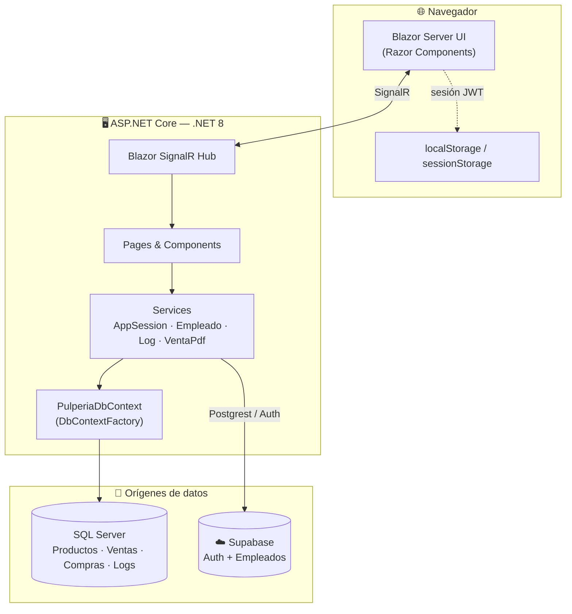

<div align="center">

# 🏪 Pulpería

### Sistema de Punto de Venta e Inventario

Gestión integral para una pulpería (tienda de abarrotes): productos, inventario, compras, ventas, empleados y auditoría — todo en una aplicación **Blazor Server** sobre **.NET 8**.

<br/>


</div>

---

## 📑 Tabla de contenidos

- [Descripción](#-descripción)
- [Características](#-características)
- [Stack tecnológico](#-stack-tecnológico)
- [Arquitectura](#-arquitectura)
- [Inicio rápido](#-inicio-rápido)
- [Configuración](#-configuración)
- [Estructura del proyecto](#-estructura-del-proyecto)
- [Comandos útiles](#-comandos-útiles)
- [Documentación](#-documentación)
- [Licencia](#-licencia)

---

## 📖 Descripción

**Pulpería** es un sistema administrativo para el día a día de una tienda de barrio. Combina dos orígenes de datos:

- 🗄️ **SQL Server** (vía Entity Framework Core) para los datos transaccionales: productos, categorías, proveedores, inventario, compras, ventas y auditoría.
- ☁️ **Supabase** (Auth + Postgrest) para la **autenticación** de usuarios y la gestión de **empleados**.

La interfaz es 100 % **Blazor Server**, con una experiencia de caja moderna, generación de **tickets en PDF** y **exportación a Excel**.

---

## ✨ Características

| Módulo | Descripción |
|--------|-------------|
| 📊 **Dashboard** | Estadísticas generales de la pulpería en la página principal. |
| 🛒 **Ventas** | Caja con carrito, métodos de pago (Efectivo, SINPE, Tarjeta, Fiado), cálculo de cambio y descuento de stock **atómico y transaccional**. |
| 📦 **Productos** | Alta, edición, detalle y control de stock (actual / mínimo) con validaciones. |
| 🏷️ **Categorías y Proveedores** | Catálogos base para clasificar productos y registrar compras. |
| 📥 **Inventario y Compras** | Registro de compras a proveedores con detalle por producto. |
| 🧾 **Tickets PDF** | Generación de recibos térmicos (58 mm) con QuestPDF. |
| 📑 **Exportación Excel** | Reportes vía ClosedXML. |
| 👥 **Empleados** | Gestión a través de Supabase. |
| 🔐 **Autenticación** | Login con Supabase Auth y sesión persistente opcional («mantener la sesión abierta»). |
| 📝 **Auditoría** | Registro de cambios (`LogCambio`) sobre las operaciones del sistema. |

---

## 🧰 Stack tecnológico

| Área | Tecnología |
|------|------------|
| Framework | .NET 8 (`net8.0`) |
| UI | Blazor Server (Razor Components) |
| ORM | Entity Framework Core 8 |
| Base de datos | SQL Server |
| Auth / Empleados | Supabase (Auth + Postgrest) |
| PDF | QuestPDF 2026.5.0 |
| Excel | ClosedXML 0.105.0 |
| Iconos | Bootstrap Icons + Font Awesome |

<details>
<summary><b>Paquetes NuGet principales</b></summary>

```
Microsoft.EntityFrameworkCore           8.0.11
Microsoft.EntityFrameworkCore.SqlServer 8.0.11
Microsoft.EntityFrameworkCore.Sqlite    8.0.11
Microsoft.EntityFrameworkCore.Design    8.0.11
Microsoft.EntityFrameworkCore.Tools     8.0.11
Supabase                                1.1.1
QuestPDF                                 2026.5.0
ClosedXML                               0.105.0
```
</details>

---

## 🏗️ Arquitectura



> Detalle completo en [`docs/ARCHITECTURE.md`](docs/ARCHITECTURE.md) y el modelo de datos en [`docs/DATA-MODEL.md`](docs/DATA-MODEL.md).

---

## 🚀 Inicio rápido

### Requisitos previos

- [.NET 8 SDK](https://dotnet.microsoft.com/download/dotnet/8.0)
- **SQL Server** accesible (local o remoto)
- Un proyecto de [**Supabase**](https://supabase.com/) (para autenticación y empleados)
- Opcional: Visual Studio 2022 (17.8+) o VS Code

### Pasos

```bash
# 1. Clonar
git clone <url-del-repositorio>
cd Pulperia

# 2. Restaurar dependencias
dotnet restore

# 3. Crear tu configuración local a partir de la plantilla
cp appsettings.Example.json appsettings.json   # (queda fuera de git)

#    …y/o cargar los secretos con User Secrets (recomendado)
dotnet user-secrets init
dotnet user-secrets set "ConnectionStrings:DefaultConnection" "Server=...;Database=Pulperia;..."
dotnet user-secrets set "Supabase:Url"     "https://TU_PROYECTO.supabase.co"
dotnet user-secrets set "Supabase:AnonKey" "TU_ANON_KEY"

# 4. Crear / migrar la base de datos
dotnet ef database update      # o se crea automáticamente al arrancar

# 5. Ejecutar
dotnet run
```

La app queda disponible en:

- 🔒 https://localhost:7164
- 🌐 http://localhost:5221

> La primera pantalla es el **login** (`/login`). Necesitas un usuario válido en Supabase Auth.

---

## ⚙️ Configuración

La configuración vive en [`appsettings.json`](appsettings.json), pero **las credenciales no deben versionarse**: usa [User Secrets](https://learn.microsoft.com/aspnet/core/security/app-secrets) en desarrollo y variables de entorno en producción.

| Clave | Descripción |
|-------|-------------|
| `ConnectionStrings:DefaultConnection` | Cadena de conexión a SQL Server. |
| `Supabase:Url` | URL del proyecto de Supabase. |
| `Supabase:AnonKey` | Clave pública/anónima de Supabase. |

> Las variables de entorno usan `__` como separador de sección: `ConnectionStrings__DefaultConnection`, `Supabase__Url`.

📄 Guía completa: [`docs/CONFIGURATION.md`](docs/CONFIGURATION.md).

---

## 📁 Estructura del proyecto

```
Pulperia/
├── App.razor                # Componente raíz Blazor
├── Program.cs               # Entrada, DI y middleware
├── _Imports.razor           # Usings globales
├── appsettings.json         # Configuración (sin secretos en repo)
│
├── Components/              # Componentes reutilizables
│   ├── Categories/ · CompraInventario/ · Products/
│   ├── Proveedor/ · Shared/ (DateRangePicker)
│   ├── Users/ (UserList) · Venta/ (GenerarTicket)
│
├── Pages/                  # Páginas enrutables (@page)
│   ├── Auth/               #   LoginPage, UserValidator
│   ├── Producto/           #   Products, EditProduct, ViewProduct
│   ├── Ventas/             #   Ventas, NuevaVenta, Editar-Venta, Venta-info
│   ├── Inventario/ · Empleado/ · Settings/ · logs/
│   └── Index.razor         #   Dashboard
│
├── Services/               # Lógica de negocio
│   ├── AppSessionService.cs    #   Sesión y auth (Supabase)
│   ├── EmpleadoService.cs      #   Empleados (Supabase)
│   ├── LogService.cs           #   Auditoría de cambios
│   └── VentaPdfGenerator.cs    #   Tickets PDF (QuestPDF)
│
├── Data/                   # PulperiaDbContext (EF Core)
├── models/                 # Modelos de dominio
├── Migrations/             # Migraciones EF Core
├── Shared/                 # MainLayout, NavMenu
├── Properties/             # launchSettings.json
└── wwwroot/                # CSS, JS, iconos
```

---

## 🛠️ Comandos útiles

```bash
dotnet restore                          # Restaurar paquetes
dotnet build                            # Compilar
dotnet run                              # Ejecutar
dotnet watch run                        # Ejecutar con hot reload
dotnet publish -c Release -o ./publish  # Publicar para producción

# Entity Framework Core
dotnet ef migrations add NombreMigracion   # Nueva migración
dotnet ef database update                  # Aplicar migraciones
```

---

## 📚 Documentación

| Documento | Contenido |
|-----------|-----------|
| [`docs/ARCHITECTURE.md`](docs/ARCHITECTURE.md) | Arquitectura, capas, ciclo de vida de servicios y flujo de una venta. |
| [`docs/DATA-MODEL.md`](docs/DATA-MODEL.md) | Modelo de datos, diagrama ER y descripción de cada entidad. |
| [`docs/CONFIGURATION.md`](docs/CONFIGURATION.md) | Configuración, secretos y despliegue. |
| [`docs/DEVELOPMENT.md`](docs/DEVELOPMENT.md) | Guía de desarrollo, convenciones y EF Core. |
| [`docs/CONTRIBUTING.md`](docs/CONTRIBUTING.md) | Cómo contribuir y flujo de ramas. |

---

## 📄 Licencia

Distribuido bajo licencia **MIT**. Consulta [LICENSE](LICENSE).

Copyright © 2026 **Steven Fabricio Gazo Maliaño**

<div align="center">
<sub>Hecho con ❤️ y .NET</sub>
</div>
