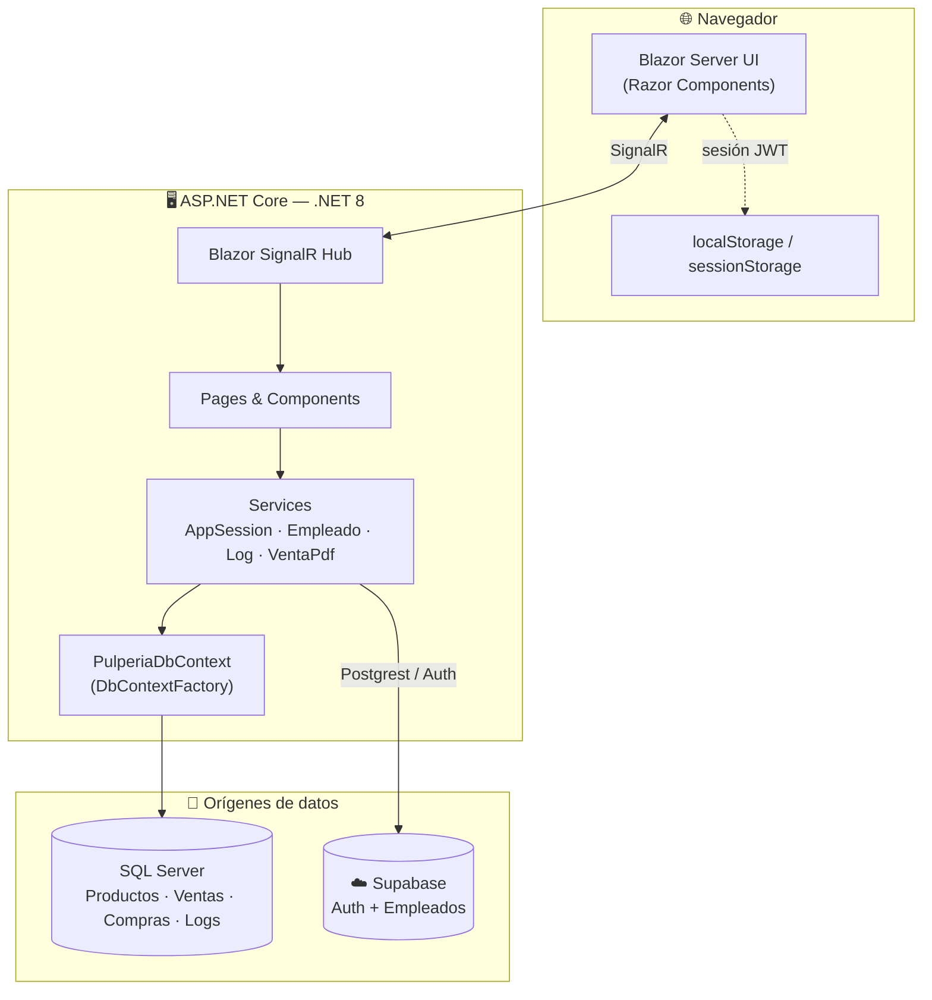

<div align="center">


# 🏪 Pulpería

#### Sistema de Punto de Venta e Inventario para tu tienda de barrio

*Productos · Inventario · Compras · Ventas · Empleados · Auditoría* — todo en una app **Blazor Server** sobre **.NET 8**.

<br/>

<!-- Badges de estado -->


<br/>

<!-- Stack visual en fila -->


<br/><br/>

[**🚀 Inicio rápido**](#-inicio-rápido) &nbsp;·&nbsp; [**🏗️ Arquitectura**](#-arquitectura) &nbsp;·&nbsp; [**📚 Documentación**](#-documentación) &nbsp;·&nbsp; [**🗺️ Roadmap**](#-roadmap)

</div>

<br/>

<div align="center">

`█████████████████████████████████████████████████████████`

</div>

<br/>

## 📖 ¿Qué es?

> **Pulpería** es un sistema administrativo para el día a día de una tienda de abarrotes. Caja rápida, control de inventario en tiempo real, tickets en PDF y auditoría de cada movimiento.

Combina **dos orígenes de datos** según su naturaleza:

<table>
<tr>
<td width="50%" valign="top">

### 🗄️ SQL Server
*vía Entity Framework Core*

Datos **transaccionales**: productos, categorías, proveedores, inventario, compras, ventas y logs de auditoría.

</td>
<td width="50%" valign="top">

### ☁️ Supabase
*Auth + Postgrest*

**Autenticación** de usuarios y gestión de **empleados** en la nube.

</td>
</tr>
</table>

<br/>

## ✨ Características

<table>
<tr>
<td width="33%" valign="top">

### 📊 Dashboard
Estadísticas generales de la pulpería de un vistazo.

</td>
<td width="33%" valign="top">

### 🛒 Ventas
Caja con carrito, 4 métodos de pago y descuento de stock **atómico y transaccional**.

</td>
<td width="33%" valign="top">

### 📦 Productos
Alta, edición, detalle y control de stock (actual / mínimo) con validaciones.

</td>
</tr>
<tr>
<td width="33%" valign="top">

### 🏷️ Catálogos
Categorías y proveedores. Crea categorías **al vuelo** desde el alta de producto.

</td>
<td width="33%" valign="top">

### 📥 Inventario
Compras a proveedores con detalle por producto y costo histórico.

</td>
<td width="33%" valign="top">

### 🧾 Tickets PDF
Recibos térmicos (58 mm) generados con QuestPDF.

</td>
</tr>
<tr>
<td width="33%" valign="top">

### 📑 Excel
Exportación de reportes vía ClosedXML.

</td>
<td width="33%" valign="top">

### 🔐 Autenticación
Login con Supabase Auth y sesión persistente opcional.

</td>
<td width="33%" valign="top">

### 📝 Auditoría
Registro de cambios (`LogCambio`) en cada operación.

</td>
</tr>
</table>

<br/>

## 🖼️ Vista previa

> 📸 *Capturas de pantalla — añade tus imágenes en `docs/assets/` y enlázalas aquí.*

<table>
<tr>
<td width="50%" align="center">

**🔐 Login**

<sub>`docs/assets/login.png`</sub>

</td>
<td width="50%" align="center">

**📊 Dashboard**

<sub>`docs/assets/dashboard.png`</sub>

</td>
</tr>
<tr>
<td width="50%" align="center">

**🛒 Nueva venta**

<sub>`docs/assets/venta.png`</sub>

</td>
<td width="50%" align="center">

**📦 Productos**

<sub>`docs/assets/productos.png`</sub>

</td>
</tr>
</table>

<br/>

## 🧰 Stack tecnológico

| | Tecnología | Versión |
|:--:|:--|:--|
|  | **.NET** | 8.0 (`net8.0`) |
|  | **Blazor Server** | Razor Components |
|  | **Entity Framework Core** | 8.0.11 |
|  | **SQL Server** | — |
|  | **Supabase** | 1.1.1 (Auth + Postgrest) |
| 📄 | **QuestPDF** | 2026.5.0 |
| 📊 | **ClosedXML** | 0.105.0 |

<details>
<summary><b>📦 Ver todos los paquetes NuGet</b></summary>

<br/>

```
Microsoft.EntityFrameworkCore           8.0.11
Microsoft.EntityFrameworkCore.SqlServer 8.0.11
Microsoft.EntityFrameworkCore.Sqlite    8.0.11
Microsoft.EntityFrameworkCore.Design    8.0.11
Microsoft.EntityFrameworkCore.Tools     8.0.11
Supabase                                1.1.1
QuestPDF                                 2026.5.0
ClosedXML                               0.105.0
```
</details>

<br/>

## 🏗️ Arquitectura



<div align="center">

📐 Detalle completo en [**`docs/ARCHITECTURE.md`**](docs/ARCHITECTURE.md) · Modelo de datos en [**`docs/DATA-MODEL.md`**](docs/DATA-MODEL.md)

</div>

<br/>

## 🚀 Inicio rápido

> **Requisitos:** [.NET 8 SDK](https://dotnet.microsoft.com/download/dotnet/8.0) · **SQL Server** accesible · un proyecto de [**Supabase**](https://supabase.com/) · *(opcional)* Visual Studio 2022 (17.8+) o VS Code

```bash
# 1️⃣  Clonar
git clone <url-del-repositorio> && cd Pulperia

# 2️⃣  Restaurar dependencias
dotnet restore

# 3️⃣  Crear tu configuración local desde la plantilla (queda fuera de git)
cp appsettings.Example.json appsettings.json

#     …o cargar los secretos con User Secrets (recomendado)
dotnet user-secrets init
dotnet user-secrets set "ConnectionStrings:DefaultConnection" "Server=...;Database=Pulperia;..."
dotnet user-secrets set "Supabase:Url"     "https://TU_PROYECTO.supabase.co"
dotnet user-secrets set "Supabase:AnonKey" "TU_ANON_KEY"

# 4️⃣  Crear / migrar la base de datos (o se crea sola al arrancar)
dotnet ef database update

# 5️⃣  ¡Ejecutar!
dotnet run
```

<div align="center">

| | URL |
|:--|:--|
| 🔒 HTTPS | https://localhost:7164 |
| 🌐 HTTP | http://localhost:5221 |

</div>

> 💡 La primera pantalla es el **login** (`/login`). Necesitas un usuario válido en Supabase Auth.

<br/>

## ⚙️ Configuración

Las credenciales **no se versionan**: usa [User Secrets](https://learn.microsoft.com/aspnet/core/security/app-secrets) en desarrollo y variables de entorno en producción. La plantilla [`appsettings.Example.json`](appsettings.Example.json) muestra la forma esperada.

| 🔑 Clave | Descripción |
|:--|:--|
| `ConnectionStrings:DefaultConnection` | Cadena de conexión a SQL Server. |
| `Supabase:Url` | URL del proyecto de Supabase. |
| `Supabase:AnonKey` | Clave pública / anónima de Supabase. |

> 🌱 Variables de entorno usan `__` como separador: `ConnectionStrings__DefaultConnection`, `Supabase__Url`.

📄 Guía completa en [**`docs/CONFIGURATION.md`**](docs/CONFIGURATION.md).

<br/>

## 📁 Estructura del proyecto

```
Pulperia/
├── 📄 Program.cs            ·  Entrada, DI y middleware
├── 🧩 App.razor             ·  Componente raíz Blazor
│
├── 📂 Components/           ·  Componentes reutilizables
│   └── Categories · Products · Proveedor · Venta · Users · Shared
│
├── 📂 Pages/                ·  Páginas enrutables (@page)
│   ├── Auth      → LoginPage, UserValidator
│   ├── Producto  → Products, EditProduct, ViewProduct
│   ├── Ventas    → Ventas, NuevaVenta, Editar-Venta, Venta-info
│   ├── Inventario · Empleado · Settings · logs
│   └── Index.razor (Dashboard)
│
├── 📂 Services/             ·  Lógica de negocio
│   ├── AppSessionService   → Sesión y auth (Supabase)
│   ├── EmpleadoService     → Empleados (Supabase)
│   ├── LogService          → Auditoría de cambios
│   └── VentaPdfGenerator   → Tickets PDF (QuestPDF)
│
├── 📂 Data/                 ·  PulperiaDbContext (EF Core)
├── 📂 models/               ·  Modelos de dominio
├── 📂 Migrations/           ·  Migraciones EF Core
├── 📂 Shared/               ·  MainLayout, NavMenu
└── 📂 wwwroot/              ·  CSS, JS, iconos
```

<br/>

## 🛠️ Comandos útiles

<table>
<tr>
<td valign="top" width="50%">

**🏃 Ejecución**
```bash
dotnet restore      # Restaurar
dotnet build        # Compilar
dotnet run          # Ejecutar
dotnet watch run    # Hot reload
```

</td>
<td valign="top" width="50%">

**🗃️ Base de datos (EF Core)**
```bash
dotnet ef migrations add Nombre
dotnet ef database update
dotnet publish -c Release -o ./publish
```

</td>
</tr>
</table>

<br/>

## 📚 Documentación

<table>
<tr>
<td width="20%" align="center">🏗️</td>
<td><a href="docs/ARCHITECTURE.md"><b>ARCHITECTURE</b></a><br/><sub>Arquitectura, capas, servicios y flujo de una venta.</sub></td>
</tr>
<tr>
<td align="center">🗂️</td>
<td><a href="docs/DATA-MODEL.md"><b>DATA-MODEL</b></a><br/><sub>Modelo de datos, diagrama ER y descripción de entidades.</sub></td>
</tr>
<tr>
<td align="center">⚙️</td>
<td><a href="docs/CONFIGURATION.md"><b>CONFIGURATION</b></a><br/><sub>Configuración, secretos y despliegue.</sub></td>
</tr>
<tr>
<td align="center">👩‍💻</td>
<td><a href="docs/DEVELOPMENT.md"><b>DEVELOPMENT</b></a><br/><sub>Guía de desarrollo, convenciones y EF Core.</sub></td>
</tr>
<tr>
<td align="center">🤝</td>
<td><a href="docs/CONTRIBUTING.md"><b>CONTRIBUTING</b></a><br/><sub>Cómo contribuir y flujo de ramas.</sub></td>
</tr>
</table>

<br/>

## 🗺️ Roadmap

- [x] Venta transaccional con descuento de stock atómico
- [x] Costo histórico correcto en líneas de venta
- [x] Sesión persistente opcional («mantener sesión abierta»)
- [x] Crear categoría desde el alta de producto
- [ ] Autorización por roles (`RolSystem` / `RolUser`)
- [ ] Migrar páginas a `DbContextFactory` efímero
- [ ] Logging estructurado con `ILogger<T>`
- [ ] Secretos fuera del historial de git + rotación

<br/>

<div align="center">

`█████████████████████████████████████████████████████████`

## 📄 Licencia

Distribuido bajo licencia **MIT** · [LICENSE](LICENSE)

Copyright © 2026 **Steven Fabricio Gazo Maliaño**

<br/>

<sub>Hecho con ❤️ y <b>.NET</b> · si te sirve, deja una ⭐</sub>

</div>
