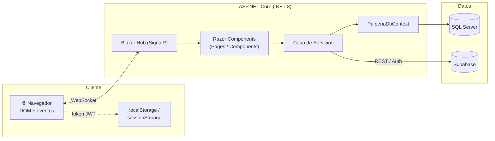
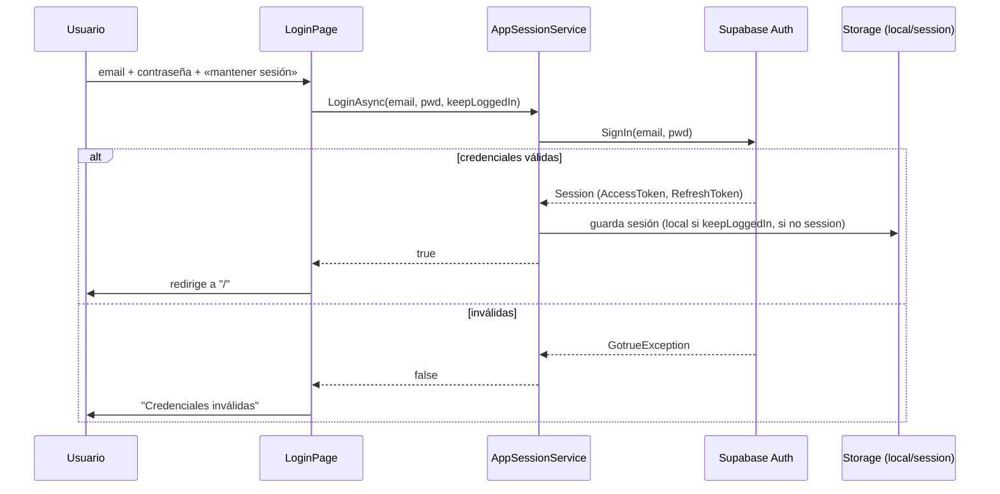
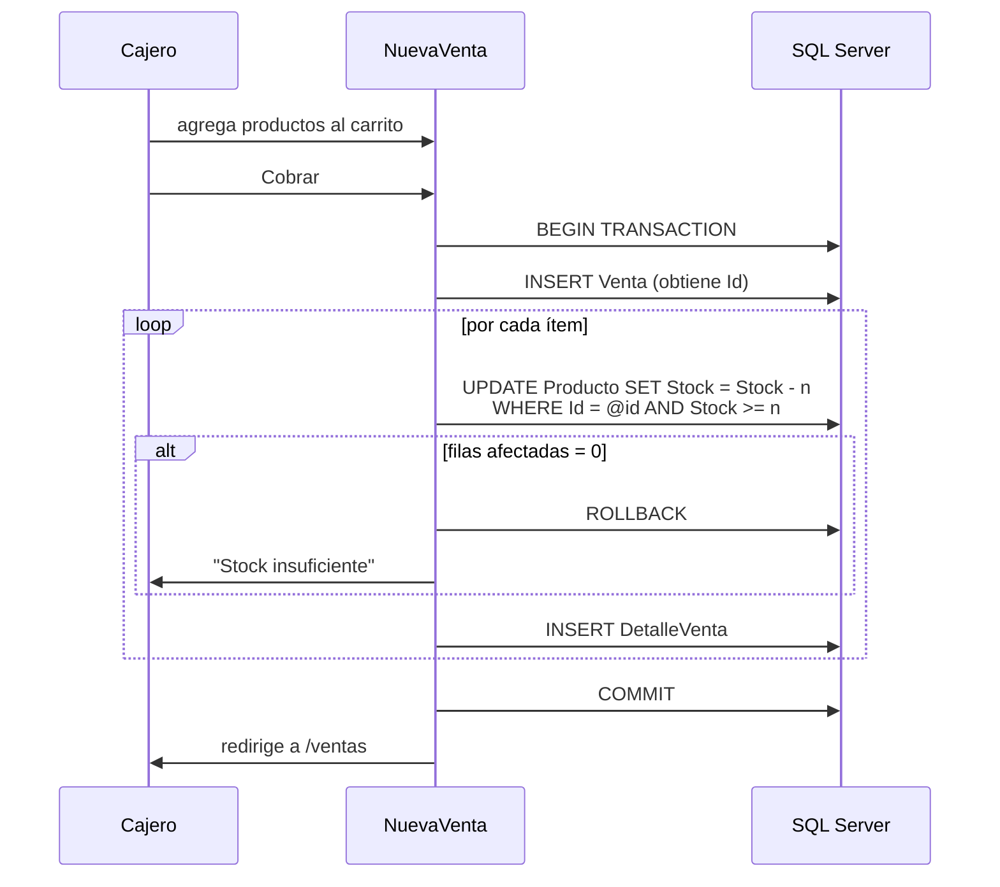
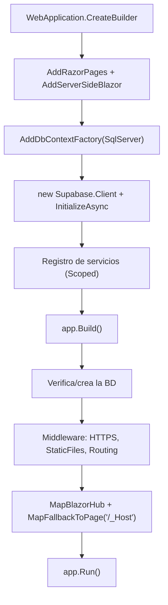

# 🏗️ Arquitectura

Este documento describe la arquitectura de **Pulpería**, sus capas, el ciclo de vida de los servicios y los flujos clave.

---

## 1. Visión general

Pulpería es una aplicación **Blazor Server** monolítica sobre **.NET 8**. El navegador mantiene un circuito **SignalR** con el servidor; toda la lógica de UI se ejecuta en el servidor y solo se transmiten diffs del DOM.



### Doble origen de datos

| Dominio | Almacén | Acceso |
|---------|---------|--------|
| Productos, Categorías, Proveedores, Compras, Ventas, Logs | **SQL Server** | EF Core (`PulperiaDbContext`) |
| Autenticación de usuarios | **Supabase Auth** | `Supabase.Client` |
| Empleados | **Supabase** (tabla `Empleados`) | Postgrest (`EmpleadoService`) |

> ⚠️ **Frontera importante:** no existe integridad referencial entre ambos almacenes. `Venta.ClienteId` guarda el `id` (GUID) de un empleado de Supabase como texto; SQL Server no puede validarlo.

---

## 2. Capas

```
Pages / Components   →  UI y orquestación (Razor)
        │
Services             →  Lógica de negocio y acceso a Supabase
        │
PulperiaDbContext    →  Acceso a datos SQL Server (EF Core)
        │
SQL Server / Supabase
```

### Componentes y páginas
- **`Pages/`** — componentes enrutables (`@page`). Cada página inyecta los servicios y el `IDbContextFactory` que necesita.
- **`Components/`** — piezas reutilizables (formularios de alta, selector de fechas, ticket, etc.).
- **`Shared/`** — `MainLayout` y `NavMenu`.
- **`Pages/Auth/UserValidator.razor`** — *gate* de autenticación: envuelve contenido protegido y exige sesión activa.

### Servicios

| Servicio | Ciclo de vida | Responsabilidad |
|----------|---------------|-----------------|
| `Supabase.Client` | **Singleton** | Cliente compartido de Supabase (Auth + Postgrest). Inicializado en `Program.cs`. |
| `AppSessionService` | **Scoped** | Login/logout, usuario actual, persistencia y restauración de sesión. |
| `EmpleadoService` | **Scoped** | Consulta de empleados vía Postgrest. |
| `LogService` | **Scoped** | Registro de auditoría (`LogCambio`) en SQL Server. |
| `VentaPdfGenerator` | **static** | Generación de tickets PDF (QuestPDF). |
| `PulperiaDbContext` | **Factory** | Vía `AddDbContextFactory`; cada operación crea su propio contexto. |

---

## 3. Acceso a datos: patrón `DbContextFactory`

En Blazor Server un `DbContext` **no** debe compartirse entre renders ni vivir mientras dura el componente (no es thread-safe y acumula estado rancio). Por eso se registra una **fábrica**:

```csharp
builder.Services.AddDbContextFactory<PulperiaDbContext>(options =>
    options.UseSqlServer(connectionString));
```

Patrón recomendado por operación:

```csharp
await using var db = await DbFactory.CreateDbContextAsync();
var productos = await db.Producto.AsNoTracking().ToListAsync();
```

> 📌 Algunas páginas todavía mantienen un `DbContext` de larga vida en un campo; migrarlas a contextos efímeros es una mejora pendiente (ver [Limitaciones](#6-limitaciones-conocidas)).

---

## 4. Autenticación y sesión



- **`keepLoggedIn = true`** → `localStorage` (persiste al cerrar el navegador, hasta 7 días).
- **`keepLoggedIn = false`** → `sessionStorage` (se borra al cerrar la pestaña).
- Al iniciar, `TryRestoreSessionAsync()` rehidrata la sesión y renueva la expiración conservando el almacén original.

> El JavaScript de almacenamiento está en [`wwwroot/sessionStorage.js`](../wwwroot/sessionStorage.js).

---

## 5. Flujo de una venta (transaccional)

`Pages/Ventas/NuevaVenta.razor` registra una venta de forma **atómica**:



Puntos clave del diseño:

- **Transacción**: venta + detalles + descuento de stock son todo-o-nada.
- **Descuento atómico con guarda** (`ExecuteUpdateAsync` con `WHERE Stock >= cantidad`): evita el *lost update* entre cajas simultáneas. La verdad del inventario la pone la base de datos, no la copia en memoria.
- **Costo histórico**: cada `DetalleVenta` guarda `PrecioUnitarioHistorico` y `CostoUnitarioHistorico` al momento de la venta, para cálculos de utilidad fieles aunque cambien los precios.

---

## 6. Limitaciones conocidas

Aspectos identificados como mejoras pendientes:

1. **Secretos en configuración** — mover credenciales fuera de `appsettings.json` (User Secrets / variables de entorno) y rotarlas.
2. **`DbContext` de larga vida** en algunas páginas — migrar a contextos efímeros por operación.
3. **Autorización por rol** — existen `RolSystem`/`RolUser`, pero `UserValidator` solo distingue «autenticado / no autenticado».
4. **Migración automática** — `Program.cs` solo migra si no puede conectar; conviene `Migrate()` idempotente al arranque.
5. **Logging estructurado** — sustituir `Console.WriteLine` por `ILogger<T>`.
6. **Archivos de plantilla** — `WeatherForecast*`, `Counter`, `FetchData`, `SurveyPrompt` pueden eliminarse.

---

## 7. Arranque (`Program.cs`)


