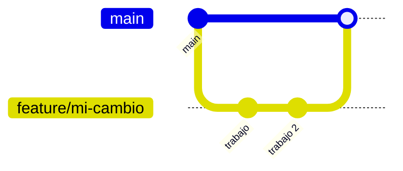

# 🤝 Guía de contribución

¡Gracias por contribuir a **Pulpería**! Esta guía resume el flujo de trabajo.

---

## Flujo de ramas



- `main` — rama estable.
- `feature/<descripcion>` — nuevas funcionalidades.
- `fix/<descripcion>` — correcciones.

---

## Pasos para contribuir

1. **Crea una rama** desde `main`:
   ```bash
   git checkout -b feature/mi-cambio
   ```
2. **Desarrolla** siguiendo las convenciones de [`DEVELOPMENT.md`](DEVELOPMENT.md).
3. **Compila y prueba**:
   ```bash
   dotnet build
   dotnet run
   ```
4. **Commit** con mensajes claros en español:
   ```bash
   git commit -m "Agrega validación de stock en venta"
   ```
5. **Push** y abre un **Pull Request** hacia `main`.

---

## Requisitos del Pull Request

- [ ] Compila sin errores (`dotnet build`).
- [ ] No introduce credenciales ni secretos.
- [ ] Incluye migración si cambió el modelo de datos.
- [ ] Describe **qué** cambia y **por qué**.
- [ ] Respeta el idioma del dominio (español) y la estructura de carpetas.

---

## Reporte de errores

Al abrir un issue, incluye:

- Pasos para reproducir.
- Comportamiento esperado vs. real.
- Entorno (SO, versión de .NET, navegador).
- Capturas o logs si aplica.

---

## Código de conducta

Sé respetuoso y constructivo. Las revisiones buscan mejorar el código, no a las personas.
