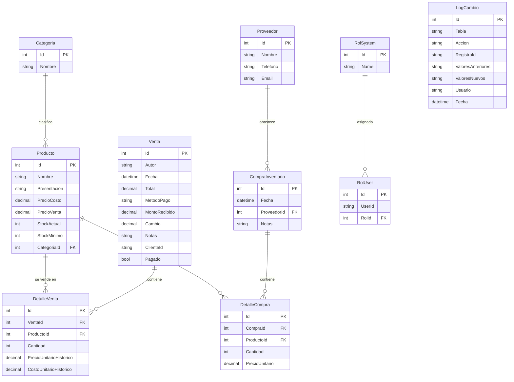

# 🗂️ Modelo de datos

Las entidades de **SQL Server** se definen en [`models/`](../models/) y se exponen vía [`PulperiaDbContext`](../Data/PulperiaDbContext.cs). Los **empleados** viven en **Supabase** y se modelan aparte con `BaseModel` de Postgrest.

---

## Diagrama entidad-relación (SQL Server)



---

## Entidades

### 📦 Producto
Artículo a la venta. Lleva precio de costo y de venta por separado, y control de stock.

| Campo | Tipo | Notas |
|-------|------|-------|
| `Id` | int | PK |
| `Nombre` | string(100) | Requerido |
| `Presentacion` | string(50) | Requerido (p. ej. «500 ml») |
| `PrecioCosto` | decimal | ≥ 0 |
| `PrecioVenta` | decimal | ≥ 0 |
| `StockActual` | int | ≥ 0 |
| `StockMinimo` | int | ≥ 0 — umbral de reposición |
| `CategoriaId` | int? | FK → Categoria (requerido) |

### 🏷️ Categoria
Agrupa productos. `Nombre` requerido (máx. 60).

### 🚚 Proveedor
Quien abastece el inventario. `Nombre`, `Telefono`, `Email`; relación 1‑N con `CompraInventario`.

### 📥 CompraInventario
Cabecera de una compra a proveedor.

| Campo | Tipo | Notas |
|-------|------|-------|
| `Id` | int | PK |
| `Fecha` | datetime | Default `UtcNow` |
| `ProveedorId` | int? | FK → Proveedor |
| `Notas` | string? | |
| `TotalCalculado` | decimal | `[NotMapped]` — suma de los detalles |

### 📋 DetalleCompra
Línea de una compra: `CompraId`, `ProductoId`, `Cantidad`, `PrecioUnitario`. `Total = Cantidad × PrecioUnitario`.

### 🧾 Venta
Cabecera de una venta.

| Campo | Tipo | Notas |
|-------|------|-------|
| `Id` | int | PK (folio) |
| `Autor` | string | Email del usuario que la registró |
| `Fecha` | datetime | |
| `Total` | decimal | |
| `MetodoPago` | string | Efectivo · SINPE · Tarjeta · Fiado |
| `MontoRecibido` | decimal | |
| `Cambio` | decimal | |
| `Notas` | string? | |
| `ClienteId` | string? | GUID de empleado en Supabase (sin FK real) |
| `Pagado` | bool | `false` cuando el método es «Fiado» |

### 🧮 DetalleVenta
Línea de una venta. **Captura precio y costo históricos** al momento de la venta.

| Campo | Tipo | Notas |
|-------|------|-------|
| `Id` | int | PK |
| `VentaId` | int | FK → Venta |
| `ProductoId` | int | FK → Producto |
| `Cantidad` | int | |
| `PrecioUnitarioHistorico` | decimal | Precio de venta al momento |
| `CostoUnitarioHistorico` | decimal | Costo al momento (para utilidad) |
| `Subtotal` | decimal | `[NotMapped]` — `Cantidad × PrecioUnitarioHistorico` |

### 🔐 RolSystem / RolUser
Catálogo de roles (`RolSystem`) y asignación a usuarios (`RolUser.UserId`). Definidos pero **aún no aplicados** en la autorización.

### 📝 LogCambio
Auditoría genérica de cambios. `LogService` serializa los valores anterior/nuevo a JSON.

| Campo | Tipo | Notas |
|-------|------|-------|
| `Tabla` | string | Entidad afectada |
| `Accion` | string | Crear / Editar / Eliminar |
| `RegistroId` | string | Id del registro |
| `ValoresAnteriores` | string? | JSON |
| `ValoresNuevos` | string? | JSON |
| `Usuario` | string | Autor del cambio |
| `Fecha` | datetime | |

### ⚠️ ProductoCosto
Modelo **vacío / reservado** ([`models/ProductoCosto.cs`](../models/ProductoCosto.cs)). Pensado para historial de costos por compra, sin implementar.

---

## Empleado (Supabase)

Vive en la tabla `Empleados` de Supabase y hereda de `BaseModel` (Postgrest), no de EF Core.

| Columna | Tipo | Notas |
|---------|------|-------|
| `id` | Guid | PK |
| `codigo_empleado` | string | |
| `nombre` / `apellido` | string | |
| `email` | string | |
| `telefono` | string? | |
| `rol` | string | |
| `activo` | bool | `EmpleadoService` filtra `Activo == true` |
| `photo` | string? | URL de foto |
| `departamento` | int? | |
| `empresa_id` | Guid? | Multi-tenant |

---

## `DbSet` registrados

```csharp
Categoria, CompraInventario, DetalleCompra, DetalleVenta,
Producto, Venta, Proveedor (Proveedores),
RolSystem (Roles), RolUser (RolUsers), LogCambio (LogsCambios)
```

> Ver [`PulperiaDbContext.cs`](../Data/PulperiaDbContext.cs). Las migraciones están en [`Migrations/`](../Migrations/).
